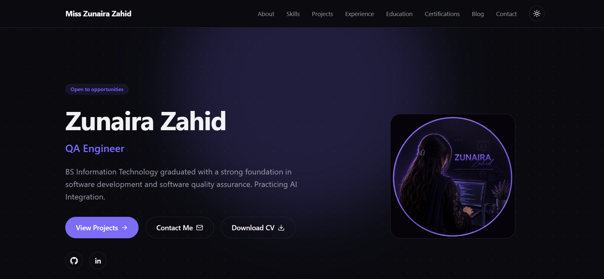
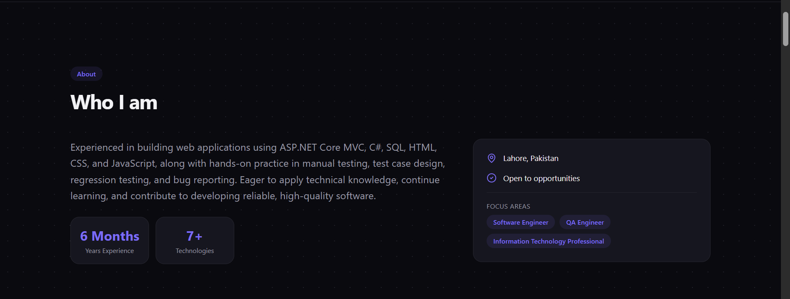
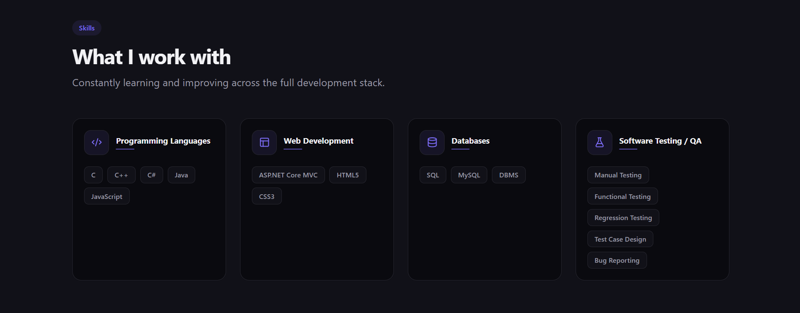
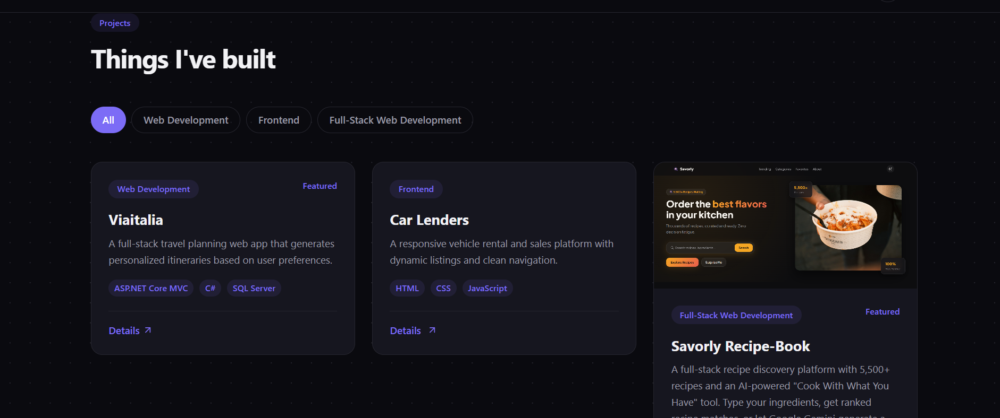
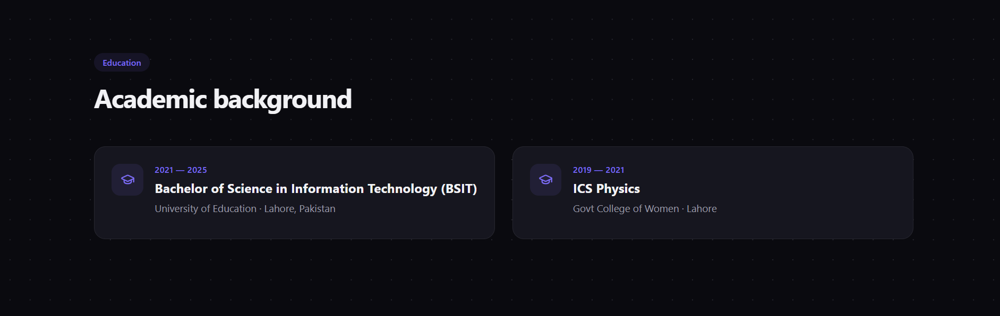
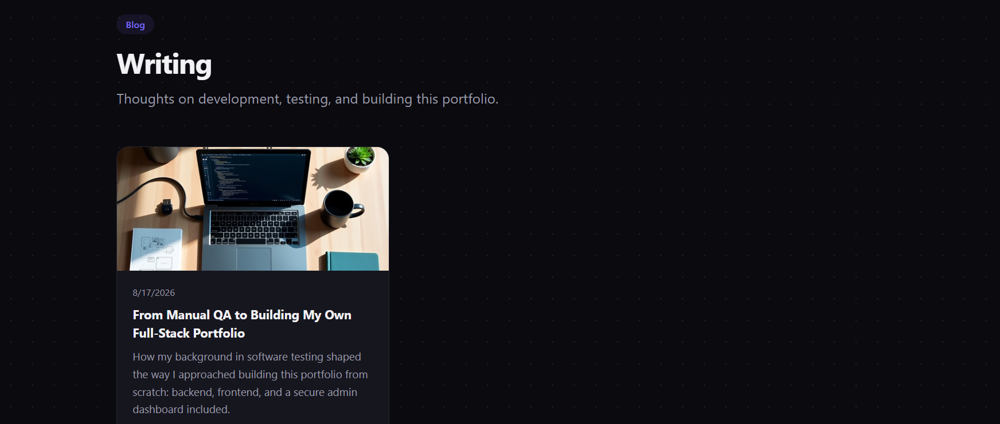
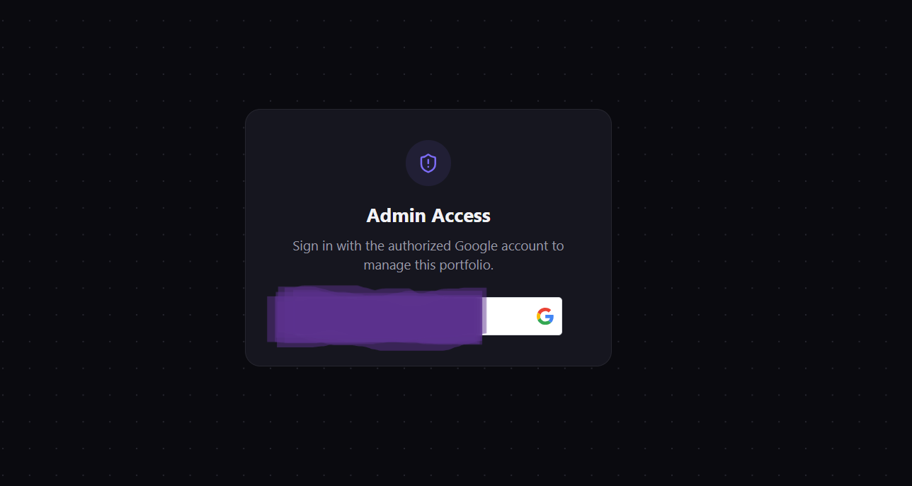
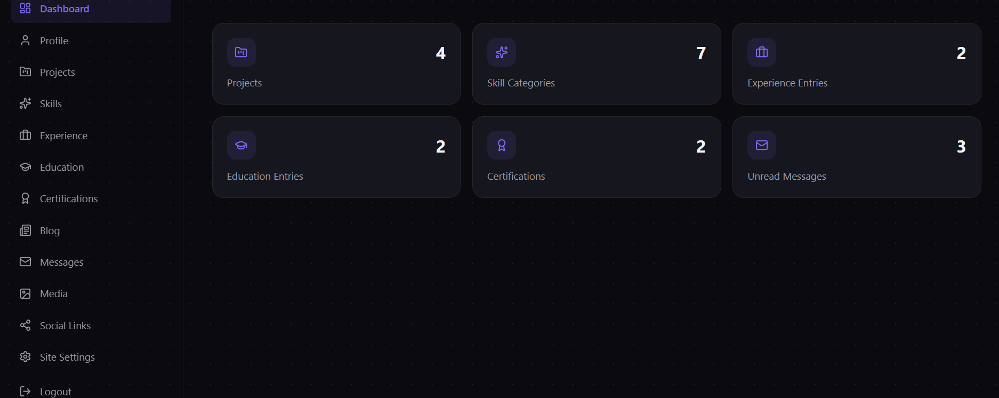
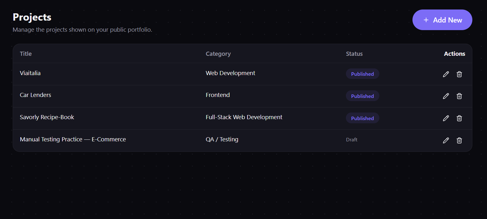
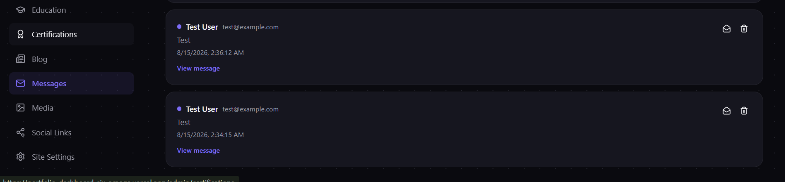

# Zunaira Zahid — Portfolio

A full-stack personal portfolio with a public site and a secure admin CMS, built to showcase real projects, skills, and experience without needing to edit code for every content update.

**Live site:** https://portfolio-dashboard-six-omega.vercel.app



## Tech Stack

**Backend — `PortfolioApi/`**
- ASP.NET Core 10 Web API
- Entity Framework Core + PostgreSQL (hosted on [Neon](https://neon.tech))
- Google Sign-In, verified server-side, cookie-based session (HttpOnly)
- Cloudinary for image and document uploads
- Deployed on [Render](https://render.com) via Docker

**Frontend — `portfolio-frontend/`**
- Next.js 16 (App Router) + TypeScript + Tailwind CSS v4
- Public portfolio site + protected `/admin` dashboard, same app
- Deployed on [Vercel](https://vercel.com)

## Features

- **Public site:** Hero, About, Skills, Projects, Experience, Education, Certifications, Blog, Contact form
- **Admin CMS:** full CRUD for every content type, real-time content management with no code changes required
- **Secure admin access:** one authorized Google account, verified entirely on the backend — never trusted from the frontend
- **Blog:** admin-managed posts with a public list and detail view
- **Media library:** upload images and PDFs directly to Cloudinary from the admin panel

## Screenshots

### Public Site

| | |
|---|---|
|  |  |
|  |  |
|  |  |

### Admin Dashboard

| | |
|---|---|
|  |  |
|  |  |

## Project Structure

```
Portfolio/
├── PortfolioApi/          ASP.NET Core backend API
├── portfolio-frontend/    Next.js frontend (public site + admin)
└── README.md
```

## Running Locally

**Backend:**
```bash
cd PortfolioApi
dotnet user-secrets set "ConnectionStrings:DefaultConnection" "your-neon-connection-string"
dotnet user-secrets set "AdminSettings:AdminEmail" "your-admin-email"
dotnet user-secrets set "GoogleAuth:ClientId" "your-google-client-id"
dotnet user-secrets set "EmailSettings:SenderPassword" "your-gmail-app-password"
dotnet user-secrets set "Cloudinary:CloudName" "your-cloudinary-cloud-name"
dotnet user-secrets set "Cloudinary:ApiKey" "your-cloudinary-api-key"
dotnet user-secrets set "Cloudinary:ApiSecret" "your-cloudinary-api-secret"
dotnet watch run
```

**Frontend:**
```bash
cd portfolio-frontend
# create .env.local with:
#   NEXT_PUBLIC_API_URL=http://localhost:5216
#   NEXT_PUBLIC_GOOGLE_CLIENT_ID=your-google-client-id
#   BACKEND_URL=http://localhost:5216
npm install
npm run dev
```

## Security

- Admin authorization is verified entirely server-side via a Google ID token, compared against a single authorized email stored in backend configuration — never trusted from the client
- Admin session uses an HttpOnly, Secure cookie — inaccessible to JavaScript, protecting against XSS token theft
- All admin write endpoints require authentication; public endpoints are strictly read-only except the contact form
- CORS is locked to specific known origins, never `AllowAnyOrigin`
- Uploaded files are validated by magic bytes (not just file extension) before storage

## License

Personal portfolio project — not licensed for reuse.
